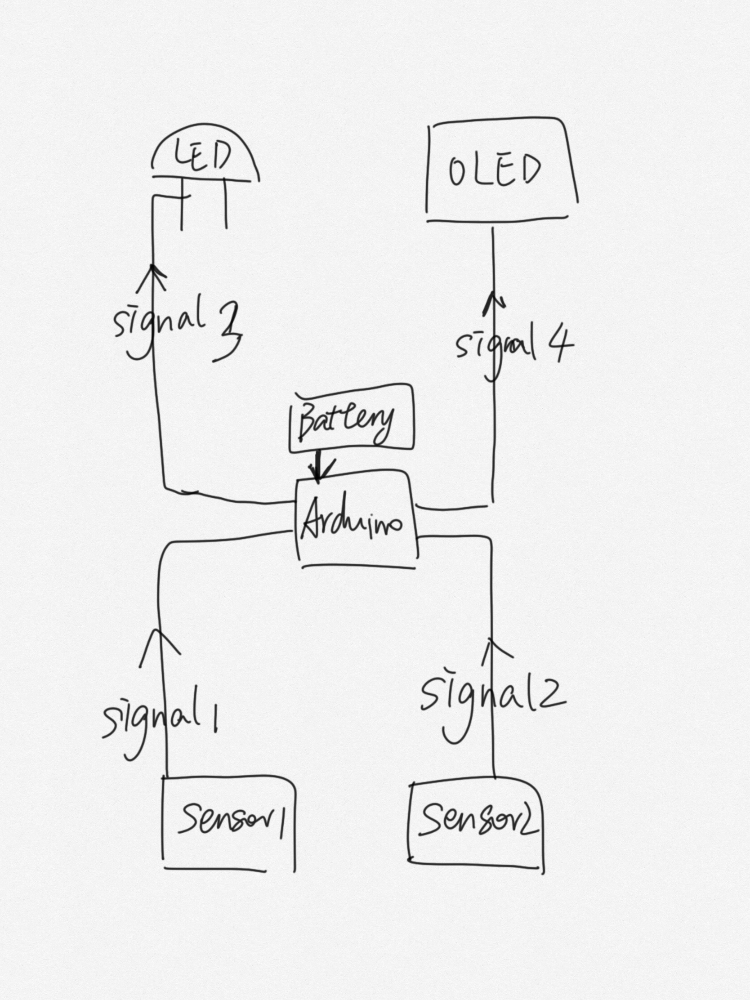

# 514-final

# 514-final Lie Detector System
Editor: GIA XIE

## Intro
This lie detector leverages multiple sensors to monitor physiological responses, including heart rate, skin conductivity, and breathing patterns. It displays these metrics on an OLED screen and activates a red LED light if it detects potential signs of deception. The system is designed to provide real-time feedback in an engaging and interactive manner.

## sensors

 - Heart Rate Sensor (MAX30100 or MAX30102): Measures the heartbeat through optical sensors or electrical signals.

 - Skin Conductivity Sensor (GSR | AD8232): Measures the electrical conductance of the skin, indicating changes in sweat levels due to stress
  

## displays

- OLED Screen(SSD1306): Displays waveforms and numerical values for heart rate, GSR, and breathing.

- Red LED: Lights up when physiological responses indicate potential deception.
  
  ### How It Works
  The microcontroller processes the data from the sensors and updates the OLED display continuously. The red LED is controlled based on the analysis of the sensor data, providing a visual alert when deception is detected.

## Device Communication

Here’s a detailed description of the communication and workflow between the devices:

- Sensor Data Collection:
The Heart Rate Sensor (MAX30100/MAX30102) and the Galvanic Skin Response Sensor (AD8232) are connected to the Arduino via analog input pins to collect heart rate and skin conductivity data in real-time.

- Data Processing:
The Arduino or Raspberry Pi processes the sensor data and performs signal analysis to determine if the values exceed predefined thresholds.

- Information Display:
Processed data is sent to the OLED Display (0.96-inch SSD1306) via the I2C interface to display current physiological metrics (heart rate, skin conductivity, etc.).
